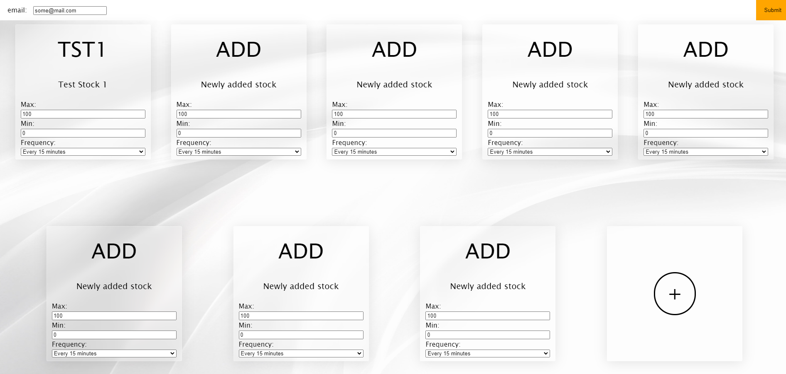
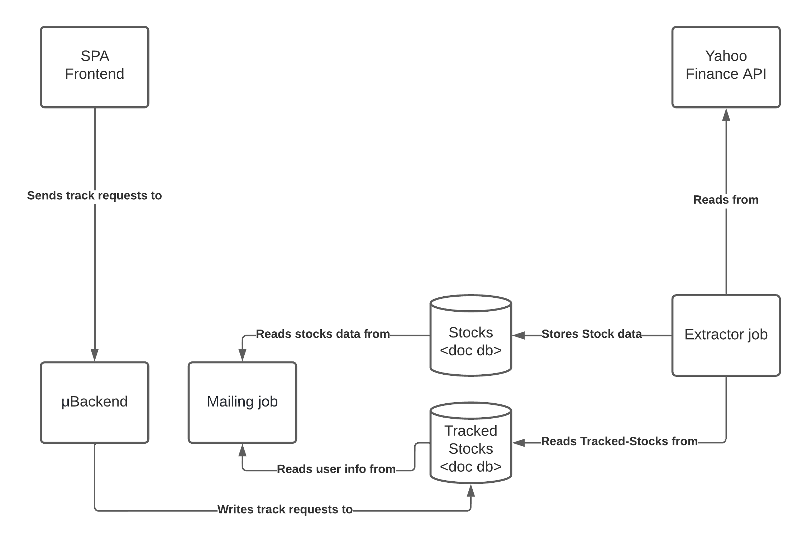

# Stock Tracker

## Summary

The project consists of a stock price tracking app, with scheduled price alerts capabilities. Users are identified by their email and can track multiple stocks at a time. They can individually set a high and low threshold and be notified in case the stock price crosses either via email. The frequency at which the price of a stock is checked can be configured on a per-stock basis.



## Application Architecture

The application consists of two scheduled jobs, two separate databases for added scalability and separation of concerns, and a single-page frontend application and microservice working as its backend.



The extractor and mailing jobs are scheduled based on cron, running inside their containers.

## Requirements

To build and run this project, you will need both Docker and Docker-Compose installed and running.

## Building and running the project

NOTE: The `docker compose` command should be replaced with `docker-compose` depending on the version of docker compose installed.

To build the project, simply launch the following command from the root folder of the repository:

```docker compose build```

after the build steps are done, you should be able to launch the application by running:

```docker compose up```

Should everything go well, the app is accessible at [this](http://localhost:80) address.

## Future works

Here are some ideas about how this project could be further improved for maximizing scalability and reliability.

### Tracked Stocks DB

This database, which is as of now a documentDb (MongoDb), could be replaced with a relational database for added reliability. As the transactions of documents aren't safeguarded from a concurrency standpoint, there could be problems with multiple users trying to update their preferences at once.

Although this could be solved whilst keeping a document Db, it would be a lot easier to track this using a relational Db.

### Job Scheduling

As described in the architecture section, the scheduling of jobs is currently maintained by crontabs within the actual job containers.

This is not only somewhat unreliable, but also wasteful, as the containers must be running even while idle to keep their schedule.

One alternative would be to use Kubernetes's cron workloads instead. The drawback is that a Kubernetes cluster would be needed, making the project harder to setup.
